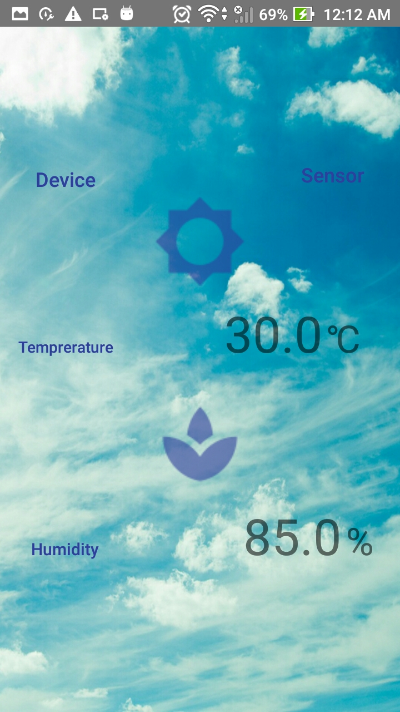

# IoTemperature
 It's an android Application to measure Temperature and Humidity of room and give you real time updates

## How it works
 1. This android application works on IoT
 2. We have deployed our hardware on NodeMCu. We are detecting Temperatute and Humidity data from DHT11 sensor.
 3. then these values are parced into JSON Array.
 4. Host a webserver at port 80 from nodemcu
 5. Print JSON array to webserver. go here for more details [ESPServer](https://github.com/vbshightime/ESPServer)
 6. At android part we are reading the JSON array from web server
 7. deserialize JSON Array to get useful values
 8. refresh it
 9. You can find the apk in repo  [IoTemperature](https://github.com/vbshightime/IoTemperature)


## Usage

### Getting Data from webserver

1. connect to following url:
  ```  
  url =new URL("http://192.168.1.102/Feed");
  ```
2. open the url connection using `HttpUrlConnection`:
  ```
  JSONObject jsonObject = new JSONObject(s);
  JSONArray jsonArray = jsonObject.getJSONArray("temp");              
 ```

### JSON Array
Our JSON contains two arrays `temp` store temperature values and `humid` store humidity values:

```JSON
{
 "device": "NodeMcu-12E",
 "sensorType": "DHT11",
 "temp": [
    "29.0"
  ],
  "humid": [
    "80.0"
  ]
}
```


## Profile





## Credits

1. Arduino JSON: https://arduinojson.org/v5/doc/encoding/ 
2. ESP8266: https://links2004.github.io/Arduino/d3/d58/class_e_s_p8266_web_server.html
